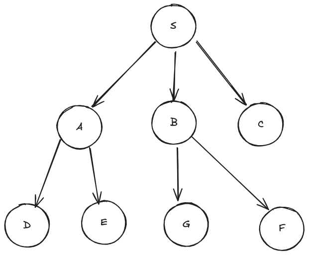

# Breadth First Search Algorithm

Breadth first search is an algorithm known for searching a tree data structure for node that satisfy a given property. It is known to traverse nodes on each breadth of the path leading from the start node to the goal node. It doesn’t visit the next depth until it has visited all the child on the current depth. Hence the name 'breadth-first' as it visits all the node on each breadth before going deeper another level. Breadth first search is aided to be complete because given a desired goal node and enough time it will find a solution path from start node to goal node so far it exists.

## BFS Search Algorithms (Python, Js and Ts) + More languages soon

This repository contains code for BFS search algorithms and it was written to be used in a tutorial both text and video tutorial explaining the USAGE of BFS search algorithm. It contains code implementation in Javascript, Python and Typescript language.

There are five files in this repository right now:

1. JavaScript implementation file
2. Optimised JavaScript implementation file
3. Typescript implementation file
4. Optimised Typescript implementation file
5. Python implementation file

You can write your own optimised python implementation fil

**Note** _It is easier to run the Js and Ts algorithms with bun runtime as it has builtin support for typescript and you won't need to do any tsconfig or typescript configuration._

### Run commands

1. Breadth-first search Js code ()
    `bun run bfs/bfs.js`

2. Breadth-first search optimised Js code ()
    `bun run bfs/optbfs.js`

3. Breadth-first search Ts code ()
    `bun run bfs/bfs.ts`

4. Breadth-first search Optimised Ts code ()
    `bun run bfs/optbfs.ts`

5. Breadth-first search Python code ()
    `python bfs/bfs.py`

### Test Graph One used in the example files

#### Graph One used in the example files


Sample Graph's adjacency list

```js
// Here is an adjacency list data structure of the graph
{
  S: ["A", "B", "C"],
  A: ["D", "E"],
  B: ["G", "F"],
  C: [],
  D: [],
  E: [],
  G: [],
  F: [],
};

```

There is also a second Graph/Tree used in the example files though cyclic hence the drawing might be a lot more dirty that the first unidirectional graph.

```js

{
  0: ["3", "5", "9"],
  1: ["6", "7", "4"],
  2: ["10", "5"],
  3: ["0"],
  4: ["1", "5", "8"],
  5: ["2", "0", "4"],
  6: ["1"],
  7: ["1"],
  8: ["4"],
  9: ["0"],
  10: ["2"],
};

```

Thank you.
Author: Olanrewaju A. Olaboye
